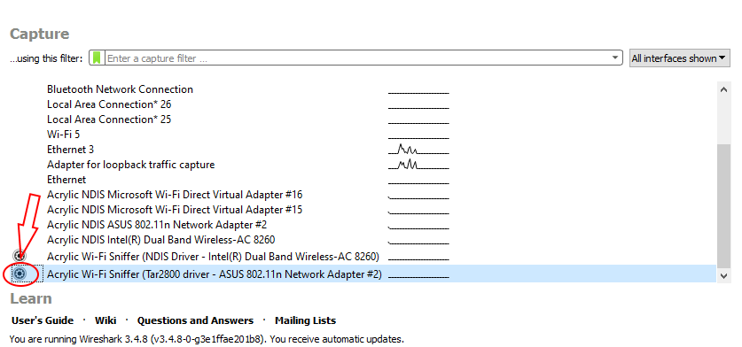
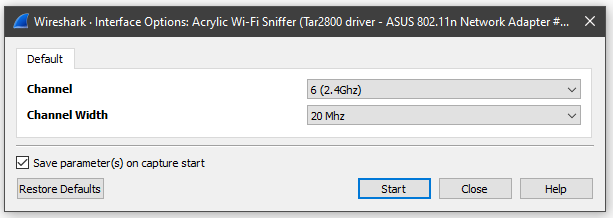
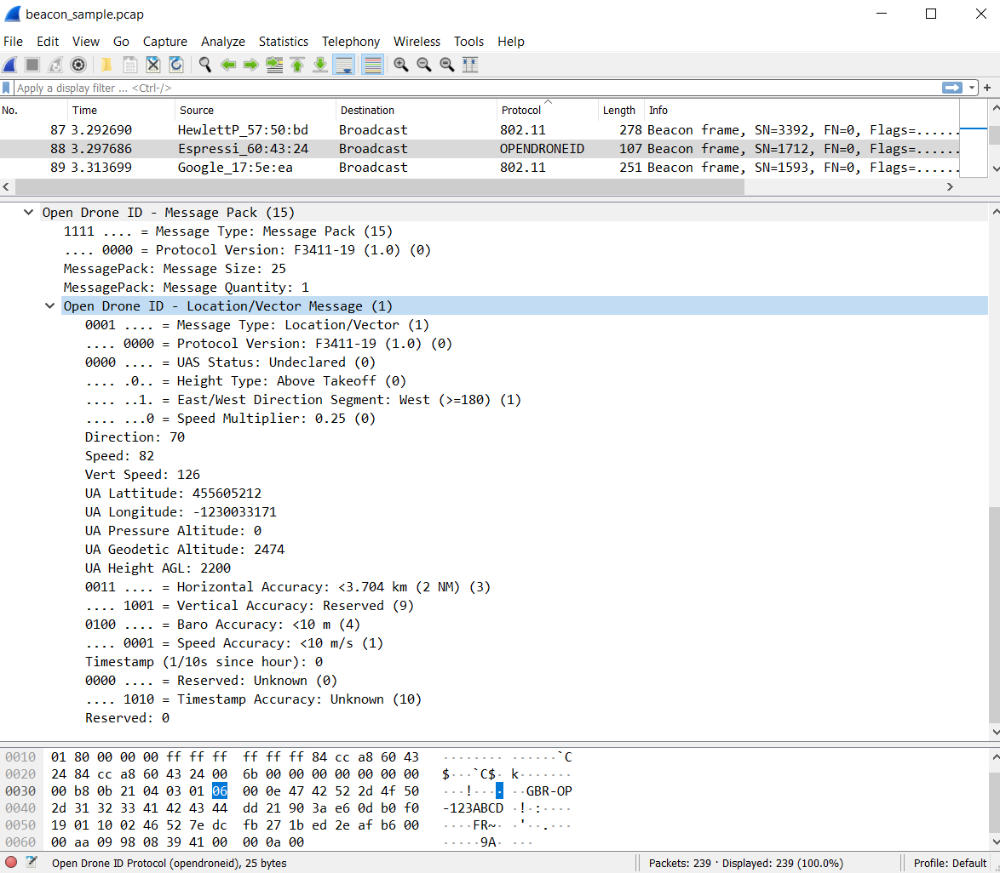
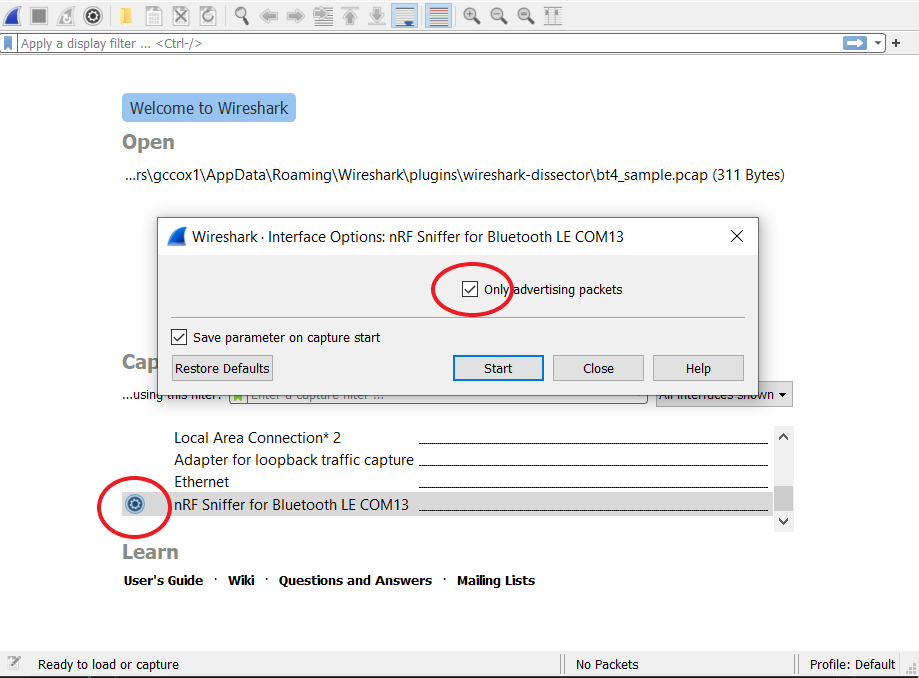
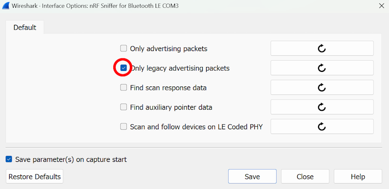
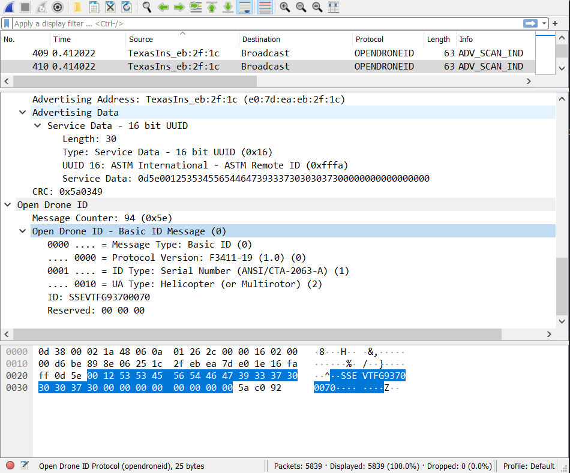

# opendroneid-wireshark-dissector

[Wireshark](https://www.wireshark.org) dissector plugin to parse and analyze captured Open Drone ID packets

It currently supports Wi-Fi Beacon, Wi-Fi NAN and Bluetooth 4.  Bluetooth 5 will be next.

### Guide

1. Installation of dissector in Wireshark (Windows)
    1. Within Wireshark, click on "Help->About->Folders->Personal Lua Plugins" and allow it to create a "plugins" folder as needed. 
    2. Clone this repo to that plugins folder.
    3. While in Wireshark, press CTRL+SHIFT+L to re-read the new dissector(s)

2. Wi-Fi sniffing
    1. Open Drone ID over Wi-Fi works from broadcast frames without a connection to any specific network.  Therefore, it is necessary to get Wireshark to sniff using "monitor mode". If you have trouble getting it working directly with your installed Wi-Fi device and drivers, we have been able to get it to work by doing the following:
    2. Install "[Acrylic Wi-Fi Sniffer](https://www.acrylicwifi.com/en/downloads-free-license-wifi-wireless-network-software-tools/download-acrylic-wi-fi-sniffer/)" (trial)
    3. Run Acrylic Wi-Fi sniffer, and click "continue"
    4. Run Wireshark **as Administrator** (this is a must)
    5. Click on "Config Gear" next to Acrylic Wi-Fi Sniffer interface.
    
    6. Select Channel 6 and 20 Mhz on the next configuration dialog.
        
    7. Many of the integrated Wi-Fi adapters will not support monitor mode (and therefore, will not work for this purpose), some USB adapters do.  A supported list can be found [here](https://www.acrylicwifi.com/en/wlan-wifi-wireless-network-software-tools/wifi-analyzer-acrylic-professional/requirements-and-compatibility/).
    If you have a monitor-mode supporting Wi-Fi adapter, then you should be able to get a sniff similar to the one below:
    

3. Bluetooth Sniffing
    1.  Although one may be able to get an integrated hardware working, you may have better luck with some external bluetooth device that has already been proven for this purpose.
    2. The [Nordic nRF52840 dongle](https://www.nordicsemi.com/Software-and-tools/Development-Kits/nRF52840-Dongle) was used to validate the dissector with both BT4 (Legacy) and BT5 (LE Coded Phy) working.  To get the dongle working, you must do the following:

        1. Install [nRF Connect](https://www.nordicsemi.com/Software-and-tools/Development-Tools/nRF-Connect-for-desktop).
        2. Within nRF Connect, install the "Programmer" app.
        3. Download/Install nRF sniffer according to the Nordic [instructions](https://infocenter.nordicsemi.com/index.jsp?topic=%2Fug_sniffer_ble%2FUG%2Fsniffer_ble%2Fintro.html).
    3. Once the BT sniffer is setup in Wireshark, be sure to start the sniffing process using the "config gear" icon and select one of the following:
		- For BT5 (LE Coded Phy): select both "Find auxillary pointer data" and "Scan and follow devices on LE Coded PHY".
        
		- For BT4 (Legacy): select "Only legacy advertising packets" in the startup dialog (this will limit the noise).
        
    4. Start Sniffing!
    
